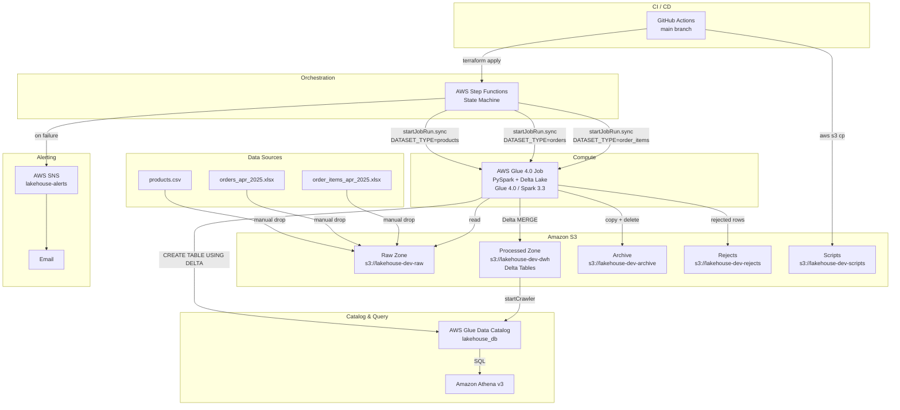
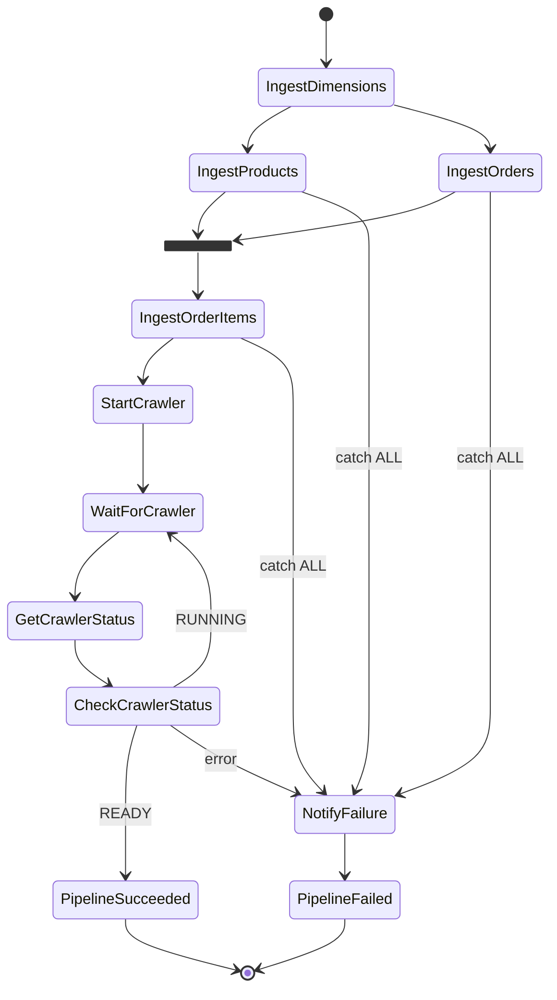
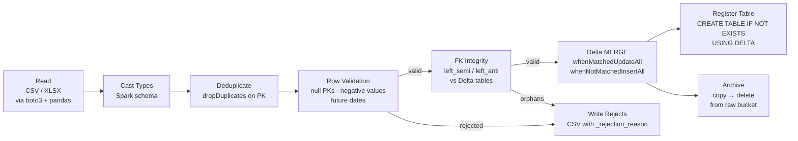

# Lakehouse Architecture on AWS

A production-grade data lakehouse built on Amazon S3, AWS Glue 4.0, Delta Lake, and AWS Step Functions. Ingests raw CSV and XLSX files, applies row-level validation and referential integrity checks, upserts into partitioned Delta tables, and exposes clean data to Amazon Athena via the Glue Data Catalog. All infrastructure is provisioned with Terraform; deployments are automated through GitHub Actions.


---

## Architecture



---

## Step Functions Orchestration



`IngestProducts` and `IngestOrders` run in **parallel** (Parallel state). `IngestOrderItems` runs after both complete because it reads the already-written `orders` and `products` Delta tables for foreign-key validation.

---

## ETL Data Flow



> FK integrity check only applies to `order_items` (validates `order_id` → `orders`, `product_id` → `products`).

---

## Project Structure

```
LAB_2/
├── .github/
│   └── workflows/
│       ├── ci.yml              # Lint + test on every PR
│       └── deploy.yml          # Package → upload → terraform apply on main
│
├── envs/
│   └── dev/
│       ├── providers.tf        # terraform{} block + provider "aws"
│       ├── main.tf             # Module wiring (calls terraform/modules/*)
│       ├── variables.tf        # Input variable declarations
│       ├── outputs.tf          # Exported values (bucket names, ARNs)
│       ├── terraform.tfvars    # Active variable values (region, email, sizing)
│       └── backend.tf          # S3 remote state template (commented until configured)
│
├── terraform/
│   └── modules/
│       ├── s3/                 # 5 buckets: raw, scripts, dwh, archive, rejects
│       ├── iam/                # GlueJobRole + StepFunctionsRole (least-privilege)
│       ├── glue/               # Glue 4.0 job, catalog database, Delta crawler
│       └── step_functions/     # State machine, SNS topic, CloudWatch log group
│           └── pipeline.json.tftpl
│
├── glue_jobs/
│   ├── main.py                 # GlueContext init + DATASET_TYPE dispatch
│   ├── jobs/
│   │   ├── products.py         # CSV → dedupe → validate → Delta upsert
│   │   ├── orders.py           # XLSX → dedupe → validate → Delta upsert (partitioned by date)
│   │   └── order_items.py      # XLSX → dedupe → validate → FK check → Delta upsert
│   └── utils/
│       ├── validators.py       # apply_validations, check_referential_integrity
│       ├── delta_ops.py        # upsert (MERGE or first-run overwrite), optimize
│       ├── s3_ops.py           # list_keys, read_csv, read_excel, archive, write_rejects
│       └── catalog.py          # register_delta_table
│
├── tests/
│   ├── conftest.py             # Session-scoped SparkSession with delta-spark
│   ├── test_validators.py
│   ├── test_products.py
│   ├── test_orders.py
│   └── test_order_items.py
│
├── .env.example                # Local dev env vars template — copy to .env
├── requirements-dev.txt
├── Makefile
└── README.md
```

---

## Prerequisites

| Tool | Version | Purpose |
|------|---------|---------|
| Python | 3.10 | Local development and tests |
| Terraform | ≥ 1.5 | Infrastructure provisioning |
| AWS CLI | v2 | Script uploads and manual triggers |
| Java | 11 or 17 | Required by PySpark locally |
| Git | any | Source control |

---

## Quick Start

### 1 — Clone and install dependencies

```powershell
git clone https://github.com/your-org/your-repo.git
cd LAB_2
pip install -r requirements-dev.txt
```

### 2 — Configure AWS credentials

```powershell
aws configure
# Prompts for: Access Key ID, Secret Access Key, default region, output format
# Stored in ~/.aws/credentials — never in this project.
```

### 3 — Run tests locally

```powershell
pytest tests/ -v --tb=short
```

Tests use a local SparkSession and mock all S3/AWS calls — no AWS credentials required.

### 4 — Provision infrastructure

```powershell
# Edit envs/dev/terraform.tfvars first: set alert_email and confirm aws_region = "eu-west-1"

cd envs/dev
terraform init
terraform plan  '-var-file=terraform.tfvars'   # review before applying
terraform apply '-var-file=terraform.tfvars'
cd ../..
```

> **PowerShell note:** the `-var-file=` flag must be quoted (`'-var-file=...'`) or PowerShell
> parses it as a property access and Terraform never sees the argument.

After apply finishes you will see a summary like:
```
Apply complete! Resources: 14 added, 0 changed, 0 destroyed.

Outputs:
  glue_job_name      = "lakehouse-dev-etl"
  raw_bucket_name    = "lakehouse-dev-raw"
  scripts_bucket_name = "lakehouse-dev-scripts"
  state_machine_arn  = "arn:aws:states:eu-west-1:xxxxxxxxxxxx:stateMachine:lakehouse-dev-pipeline"
```
Keep these output values — you will need them in the steps below.

### 5 — Package and upload Glue scripts

**Windows (PowerShell)**
```powershell
New-Item -ItemType Directory -Force -Path dist | Out-Null
Compress-Archive -Path glue_jobs/utils, glue_jobs/jobs -DestinationPath dist/etl_libs.zip -Force

cd envs/dev
$SCRIPTS_BUCKET = terraform output -raw scripts_bucket_name
cd ../..

aws s3 cp dist/etl_libs.zip "s3://$SCRIPTS_BUCKET/glue_jobs/etl_libs.zip"
aws s3 cp glue_jobs/main.py  "s3://$SCRIPTS_BUCKET/glue_jobs/main.py"
```

**Linux / macOS (bash)**
```bash
mkdir -p dist
cd glue_jobs && zip -r ../dist/etl_libs.zip utils/ jobs/ && cd ..

SCRIPTS_BUCKET=$(cd envs/dev && terraform output -raw scripts_bucket_name)

aws s3 cp dist/etl_libs.zip s3://$SCRIPTS_BUCKET/glue_jobs/etl_libs.zip
aws s3 cp glue_jobs/main.py  s3://$SCRIPTS_BUCKET/glue_jobs/main.py
```

### 6 — Drop raw files into S3

**Windows (PowerShell)**
```powershell
cd envs/dev
$RAW_BUCKET = terraform output -raw raw_bucket_name
cd ../..

aws s3 cp "Project 2 - Lakehouse Architecture/Data/products.csv" `
    "s3://$RAW_BUCKET/products/products.csv"
aws s3 cp "Project 2 - Lakehouse Architecture/Data/orders_apr_2025.xlsx" `
    "s3://$RAW_BUCKET/orders/orders_apr_2025.xlsx"
aws s3 cp "Project 2 - Lakehouse Architecture/Data/order_items_apr_2025.xlsx" `
    "s3://$RAW_BUCKET/order_items/order_items_apr_2025.xlsx"
```

**Linux / macOS (bash)**
```bash
RAW_BUCKET=$(cd envs/dev && terraform output -raw raw_bucket_name)

aws s3 cp "Project 2 - Lakehouse Architecture/Data/products.csv" \
    s3://$RAW_BUCKET/products/products.csv
aws s3 cp "Project 2 - Lakehouse Architecture/Data/orders_apr_2025.xlsx" \
    s3://$RAW_BUCKET/orders/orders_apr_2025.xlsx
aws s3 cp "Project 2 - Lakehouse Architecture/Data/order_items_apr_2025.xlsx" \
    s3://$RAW_BUCKET/order_items/order_items_apr_2025.xlsx
```

### 7 — Trigger the pipeline

**Windows (PowerShell)**
```powershell
cd envs/dev
$STATE_MACHINE_ARN = terraform output -raw state_machine_arn
cd ../..

aws stepfunctions start-execution `
    --state-machine-arn $STATE_MACHINE_ARN `
    --input '{"run_date": "2025-04-01"}'
```

**Linux / macOS (bash)**
```bash
STATE_MACHINE_ARN=$(cd envs/dev && terraform output -raw state_machine_arn)

aws stepfunctions start-execution \
    --state-machine-arn $STATE_MACHINE_ARN \
    --input '{"run_date": "2025-04-01"}'
```

The command returns an `executionArn`. Copy it — you need it to monitor progress.

### 8 — Monitor the execution

**Option A — AWS Console (easiest to see the graph)**

1. Open [AWS Step Functions](https://eu-west-1.console.aws.amazon.com/states) in your browser (make sure the region selector in the top-right is set to **eu-west-1**).
2. Click **State machines** → `lakehouse-dev-pipeline`.
3. Under **Executions**, click the running execution.
4. The graph view shows each state turning green (succeeded) or red (failed) in real time.

**Option B — CLI**

```powershell
# Poll status (replace <execution-arn> with the ARN from step 7)
aws stepfunctions describe-execution --execution-arn <execution-arn> `
    --query '{status: status, startDate: startDate, stopDate: stopDate}'
```

Expected status values: `RUNNING` → `SUCCEEDED` (or `FAILED`).

**How long it takes**

| Phase | Typical duration |
|-------|-----------------|
| IngestProducts + IngestOrders (parallel) | 3–6 min (Glue cold start ~2 min + job run) |
| IngestOrderItems | 2–4 min |
| Crawler + status poll loop | 1–2 min |
| **Total** | **~6–12 min** |

**If the execution fails**

- The SNS topic sends an email to your `alert_email`.
- Click the failed state in the Console graph to see the error message.
- For full Glue logs: **AWS Glue → Jobs → lakehouse-dev-etl → Run history** → click the run → **Output logs**.
- For Step Functions logs: **CloudWatch → Log groups → `/aws/states/lakehouse-dev-pipeline`**.

### 9 — Query results in Athena

Once the execution reaches `PipelineSucceeded` the Glue crawler has already updated the catalog. Open [Athena](https://eu-west-1.console.aws.amazon.com/athena) and set the **Data source** to `AwsDataCatalog` and **Database** to `lakehouse_db`.

---

## Infrastructure

All AWS resources are managed by Terraform. No manual console configuration required.

### S3 Buckets

| Bucket | Purpose | Extras |
|--------|---------|--------|
| `lakehouse-{env}-raw` | Landing zone for raw files | Versioning enabled |
| `lakehouse-{env}-scripts` | Glue ETL scripts and `etl_libs.zip` | SSE-AES256 |
| `lakehouse-{env}-dwh` | Delta Lake tables (processed) | Versioning enabled |
| `lakehouse-{env}-archive` | Originals after successful ingest | Lifecycle: Glacier after 90 days |
| `lakehouse-{env}-rejects` | Rows that failed validation | SSE-AES256 |

All buckets have public access fully blocked.

### IAM Roles

**`GlueJobRole`** — assumed by `glue.amazonaws.com`
- `AWSGlueServiceRole` (managed policy)
- Custom policy: `s3:GetObject`, `s3:PutObject`, `s3:DeleteObject` on all 5 buckets; `glue:*` for catalog; CloudWatch Logs

**`StepFunctionsRole`** — assumed by `states.amazonaws.com`
- `glue:StartJobRun`, `glue:GetJobRun`, `glue:StartCrawler`, `glue:GetCrawler`
- `sns:Publish` on the alerts topic

### Glue Job Parameters

The single Glue job `lakehouse-{env}-etl` is parameterized. Step Functions overrides two arguments per invocation:

| Argument | Set by | Example |
|----------|--------|---------|
| `--DATASET_TYPE` | Step Functions | `products`, `orders`, `order_items` |
| `--RUN_DATE` | Step Functions | `2025-04-01` |
| `--RAW_BUCKET` | Terraform default | `lakehouse-dev-raw` |
| `--DWH_BUCKET` | Terraform default | `lakehouse-dev-dwh` |
| `--ARCHIVE_BUCKET` | Terraform default | `lakehouse-dev-archive` |
| `--REJECT_BUCKET` | Terraform default | `lakehouse-dev-rejects` |
| `--DATABASE_NAME` | Terraform default | `lakehouse_db` |

---

## Delta Lake Tables

### `lakehouse_db.products`
| Column | Type | Constraints |
|--------|------|-------------|
| product_id | INT | PK, not null |
| department_id | INT | |
| department | STRING | |
| product_name | STRING | not null |

- Merge key: `product_id`
- Partitioning: none

### `lakehouse_db.orders`
| Column | Type | Constraints |
|--------|------|-------------|
| order_num | INT | |
| order_id | INT | PK, not null |
| user_id | INT | not null |
| order_timestamp | TIMESTAMP | |
| total_amount | DOUBLE | ≥ 0 |
| date | DATE | not null, not future |

- Merge key: `order_id`
- Partition: `date`

### `lakehouse_db.order_items`
| Column | Type | Constraints |
|--------|------|-------------|
| id | INT | PK, not null |
| order_id | INT | not null, FK → orders |
| user_id | INT | |
| days_since_prior_order | INT | |
| product_id | INT | not null, FK → products |
| add_to_cart_order | INT | |
| reordered | INT | |
| order_timestamp | TIMESTAMP | |
| date | DATE | |

- Merge key: `id`
- Partition: `date`

---

## Data Validation

### Row-level validation (`apply_validations`)

Applies a chain of rules. The **first matching rule** wins — a row is tagged with one reason and moved to the rejects bucket.

| Rule | Datasets | Rejection reason |
|------|----------|-----------------|
| Null required fields (`product_id`, `product_name`) | products | `null_required_field` |
| Null required fields (`order_id`, `user_id`, `date`) | orders | `null_required_field` |
| Null required fields (`id`, `order_id`, `product_id`) | order_items | `null_required_field` |
| `total_amount < 0` | orders | `negative_total_amount` |
| `date > today` | orders | `future_order_date` |

### Referential integrity (`check_referential_integrity`)

Runs **after** row-level validation on `order_items` only, using Spark `left_anti` joins against the already-written Delta tables.

| Check | Rejection reason |
|-------|-----------------|
| `order_id` not in `orders.order_id` | `orphan_order_id` |
| `product_id` not in `products.product_id` | `orphan_product_id` |

### Reject file location

```
s3://lakehouse-{env}-rejects/rejects/{dataset}/{run_date}/part-*.csv
```

Each file includes all original columns plus `_rejection_reason`.

---

## Querying with Athena

After the crawler completes, all three tables are queryable immediately:

```sql
-- Highest-value orders for a specific date partition
SELECT order_id, user_id, total_amount, order_timestamp
FROM lakehouse_db.orders
WHERE date = DATE '2025-04-01'
ORDER BY total_amount DESC
LIMIT 10;

-- Total revenue and average order value
SELECT COUNT(*) AS order_count,
       ROUND(SUM(total_amount), 2) AS total_revenue,
       ROUND(AVG(total_amount), 2) AS avg_order_value
FROM lakehouse_db.orders;

-- Most frequently ordered products, with their department
SELECT p.product_name, p.department, COUNT(*) AS times_ordered
FROM lakehouse_db.order_items oi
JOIN lakehouse_db.products p ON oi.product_id = p.product_id
GROUP BY p.product_name, p.department
ORDER BY times_ordered DESC
LIMIT 10;

-- Reorder rate by department
SELECT p.department,
       ROUND(AVG(CAST(oi.reordered AS DOUBLE)) * 100, 1) AS reorder_pct
FROM lakehouse_db.order_items oi
JOIN lakehouse_db.products p ON oi.product_id = p.product_id
GROUP BY p.department
ORDER BY reorder_pct DESC;
```

> Rejected rows are written as CSV to `s3://lakehouse-{env}-rejects/rejects/{dataset}/{run_date}/` and are **not** registered as Athena tables. Inspect them with `aws s3 cp ... --recursive` or point a separate crawler at the rejects bucket if you want to query them in SQL.

---

## CI/CD

### `ci.yml` — runs on every Pull Request to `main`

```
checkout → setup Python 3.10 → pip install → flake8 lint → pytest
```

Tests run fully locally using a `delta-spark` SparkSession. No AWS credentials needed.

### `deploy.yml` — runs on every push to `main`

```
checkout → configure AWS → pip install → pytest → zip ETL libs
→ cd envs/dev → terraform init → resolve bucket name → aws s3 cp → terraform apply
```

Tests are re-run before deploy. A failing test blocks the deployment.

### Required GitHub Secrets

| Secret | Description |
|--------|-------------|
| `AWS_ACCESS_KEY_ID` | IAM access key for deployment |
| `AWS_SECRET_ACCESS_KEY` | IAM secret key for deployment |
| `ALERT_EMAIL` | Email address for SNS failure notifications |

---

## Local Development

**Windows (PowerShell)**

```powershell
# Install dependencies
pip install -r requirements-dev.txt

# Run tests
pytest tests/ -v --tb=short

# Lint
flake8 glue_jobs/ --max-line-length=120 --extend-ignore=E203,W503

# Package ETL libs
New-Item -ItemType Directory -Force -Path dist | Out-Null
Compress-Archive -Path glue_jobs/utils, glue_jobs/jobs -DestinationPath dist/etl_libs.zip -Force

# Upload to S3
aws s3 cp dist/etl_libs.zip "s3://$env:SCRIPTS_BUCKET/glue_jobs/etl_libs.zip"
aws s3 cp glue_jobs/main.py  "s3://$env:SCRIPTS_BUCKET/glue_jobs/main.py"

# Terraform
cd envs/dev
terraform init
terraform plan  '-var-file=terraform.tfvars'
terraform apply '-var-file=terraform.tfvars'
cd ../..

# Clean
Remove-Item -Recurse -Force dist, .pytest_cache -ErrorAction SilentlyContinue
```

**Linux / macOS (bash)**

```bash
# Install dependencies
pip install -r requirements-dev.txt

# Run tests
pytest tests/ -v --tb=short

# Lint
flake8 glue_jobs/ --max-line-length=120 --extend-ignore=E203,W503

# Package ETL libs
mkdir -p dist
cd glue_jobs && zip -r ../dist/etl_libs.zip utils/ jobs/ && cd ..

# Upload to S3
aws s3 cp dist/etl_libs.zip s3://$SCRIPTS_BUCKET/glue_jobs/etl_libs.zip
aws s3 cp glue_jobs/main.py  s3://$SCRIPTS_BUCKET/glue_jobs/main.py

# Terraform
cd envs/dev
terraform init
terraform plan  '-var-file=terraform.tfvars'
terraform apply '-var-file=terraform.tfvars'
cd ../..

# Clean
rm -rf dist/ .pytest_cache/ __pycache__/
```

---

## Configuration Reference

```hcl
# envs/dev/terraform.tfvars

aws_region  = "eu-west-1"                    # AWS region for all resources
project     = "lakehouse"                     # Resource name prefix
environment = "dev"                           # Environment suffix
alert_email = "your-email@example.com"        # SNS notification target

# Glue job sizing
glue_job_worker_type         = "G.1X"  # G.1X (4 vCPU, 16 GB) or G.2X (8 vCPU, 32 GB)
glue_job_num_workers         = 2       # Number of DPU workers
glue_job_timeout_minutes     = 30      # Per-job timeout
glue_job_max_retries         = 0       # Glue-level retries (Step Functions handles retry logic)
glue_job_max_concurrent_runs = 2       # Allows parallel products + orders execution
```

---

## Operational Runbook

### Check pipeline status

**Windows (PowerShell)**
```powershell
cd envs/dev
$SFN_ARN = terraform output -raw state_machine_arn
cd ../..

aws stepfunctions list-executions --state-machine-arn $SFN_ARN --max-results 5
aws stepfunctions describe-execution --execution-arn <execution-arn>
```

**Linux / macOS (bash)**
```bash
SFN_ARN=$(cd envs/dev && terraform output -raw state_machine_arn)

aws stepfunctions list-executions --state-machine-arn $SFN_ARN --max-results 5
aws stepfunctions describe-execution --execution-arn <execution-arn>
```

### Re-run a failed dataset manually

**Windows (PowerShell)**
```powershell
cd envs/dev
$JOB_NAME = terraform output -raw glue_job_name
cd ../..

aws glue start-job-run --job-name $JOB_NAME `
    --arguments '{\"--DATASET_TYPE\":\"order_items\",\"--RUN_DATE\":\"2025-04-01\"}'
```

**Linux / macOS (bash)**
```bash
JOB_NAME=$(cd envs/dev && terraform output -raw glue_job_name)

aws glue start-job-run --job-name $JOB_NAME \
    --arguments '{"--DATASET_TYPE":"order_items","--RUN_DATE":"2025-04-01"}'
```

### Inspect rejects

```bash
# List reject files for a run (same on both platforms)
aws s3 ls s3://lakehouse-dev-rejects/rejects/order_items/2025-04-01/

# Download and inspect
aws s3 cp s3://lakehouse-dev-rejects/rejects/order_items/2025-04-01/ ./rejects/ --recursive
```

### Destroy all infrastructure

```powershell
# PowerShell
cd envs/dev
terraform destroy '-var-file=terraform.tfvars'
```

```bash
# bash
cd envs/dev
terraform destroy '-var-file=terraform.tfvars'
```

> This will delete all S3 buckets and their contents. Ensure data is backed up first.
